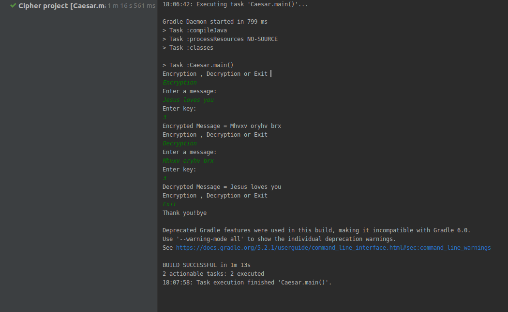

# CipherProject

This is a coding and decoding project, that uses encryption and decryption methods
in short it's a caesar cipher

## Author

***Uwimana Rachel***

## BDD(Behavior Driven Development)

***Input***

* Choose what you want to do on the menu:
  * Encryption  
  * Decryption or  ***(approve it by input the word as it is written respecting the capitalization used.)***
  * Exit

 
* In the Encryption/Decryption part you will notice an output telling you to enter the word you want to edit and a key.
  Input the word and the number(In this project the key used is only a number).
  
***Output***

* At first you will receive a menu as said above asking you to choose what you want to do.
* After inputting the name and key required you will receive the decrypted or encrypted word you wanted.
* If you choose to exit, you will receive a message thanking you and giving you farewells and this will 
terminate the server.

## Contacts

**urakhel7@gmail.com**

## Technologies used

* Java(hats to you!!)

### License and copyright

MIT License

### Screenshot showing my project's functionality

